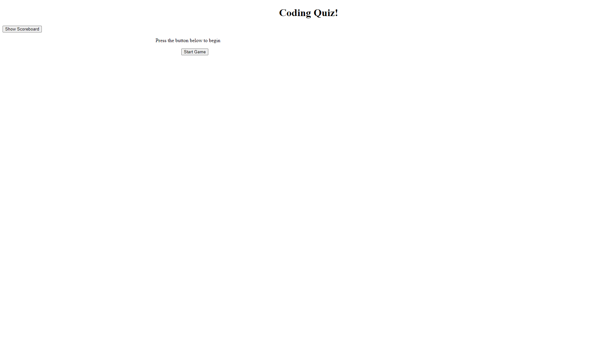

# coding-quiz

## Description

This project is a simple quiz for those wanting to study a bit of JavaScript! I created this project as an excercise for my own JavaScript knowledge. Once the user visits the deployed project page, they will be visited with a rather simplistic website. Here, the user can click 'Start Game' to begin the quiz. From this point, the user will have 60 seconds to answer as many questions as they can. Once all of the questions have been answered, their remaining time will be saved as their score and they will have the oportunity to enter their initials. Once entered, their initials as well as their score will be saved in local storage and displayed in the scoreboard. The scoreboard can be viewed by clicking the 'Show Scoreboard' button on the left of the screen. The top five scores are recorded here along with thier player's initials, and they persist on a refresh. 

At the time of writting, this quiz only has three questions to get through. While that is few in number, I designed this quiz to be unlimited in the amount of questions possible. Each question is stored in an array of objects and everything refrenses this array. This means that as long as the example questions' template is followed, ther is no limit to the amount of question possible. To further add, each question is randomized in order, but never repeats in a single quiz session. Along with question randomization the answers are also shuffled around in location. These features will persist with any new question added with ease. 

Although I am happy with most of the JavaScript in this project, it does leave much to be desired visually. My main goal with this project was simply to practice my logic ability in JavaScript, and so CSS was never introduced. I hope to change this at some point in the future should time allow, and purhaps add many more questions to make a proper quiz.

Link to the deployed project: https://distantdig.github.io/coding-quiz/